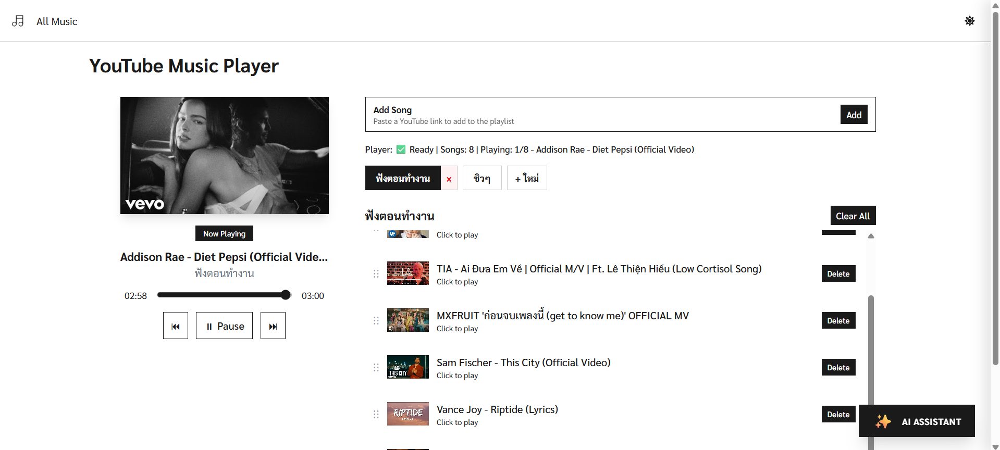
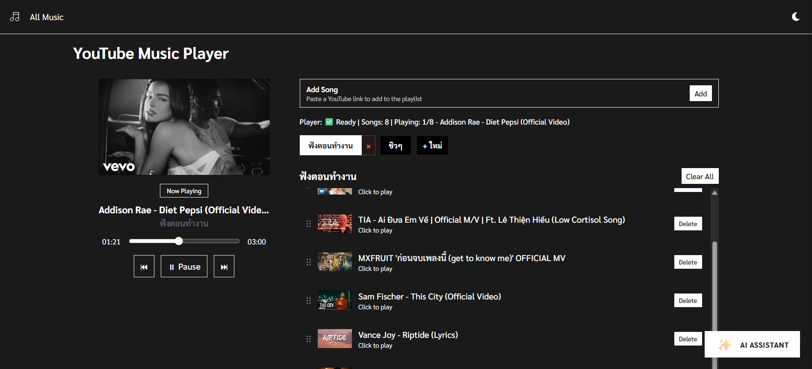

# My Music Library

แอปพลิเคชันคลังเพลงอัจฉริยะที่พัฒนาด้วย Next.js มาพร้อมกับระบบผู้ช่วย AI ที่ช่วยให้ผู้ใช้งานสามารถจัดการและควบคุมการฟังเพลงได้อย่างสะดวกสบาย ระบบสามารถรับคำสั่งผ่านภาษาธรรมชาติ (Natural Language) เพื่อเล่นเพลงในคลัง หรือค้นหาและเพิ่มเพลงใหม่จาก YouTube ได้โดยอัตโนมัติ



## คุณสมบัติหลัก

- **ระบบผู้ช่วยส่วนตัว AI**: ควบคุมการเล่นเพลงและสั่งการโปรแกรมผ่านข้อความโดยระบุความต้องการด้วยภาษาธรรมชาติ (รองรับแพลตฟอร์ม Groq API)
- **บูรณาการเข้ากับ YouTube**: ระบบสามารถวิเคราะห์คำสั่ง ค้นหา และดึงข้อมูลเพลงจากแพลตฟอร์ม YouTube ได้โดยอัตโนมัติเมื่อผู้ใช้ต้องการฟังเพลงที่ไม่มีอยู่ในคลังระบบ
- **หน้าต่างลอย Picture-in-Picture (PiP)**: รองรับการแสดงผลหน้าต่างเล่นเพลงขนาดเล็กแบบลอยตัวบนหน้าจอ ช่วยให้ผู้ใช้สามารถดูรูปย่อและควบคุมการเล่นเพลงได้แม้จะสลับไปใช้งานโปรแกรมอื่นหน้าต่างอื่น
- **การจัดการคลังเพลงส่วนตัว**: การจัดการรายการเพลงเบื้องต้นและควบคุมการเล่นแอปพลิเคชันอย่างราบรื่น
- **ส่วนติดต่อผู้ใช้งานที่ทันสมัย**: พัฒนาส่วนแสดงผลกราฟิกและสถานะผู้ใช้งานด้วย React และออกแบบความสวยงามด้วย Tailwind CSS

## เทคโนโลยีที่ใช้งาน

- **Framework**: Next.js 15
- **Frontend Application**: React 19
- **การออกแบบ UI**: Tailwind CSS v4
- **AI Provider**: Groq SDK
- **เครื่องมือเชื่อมต่อระบบภายนอก**: yt-search สำหรับค้นหาวิดีโอจาก YouTube

## การติดตั้งและเตรียมความพร้อม

ตรวจสอบให้แน่ใจว่าอุปกรณ์ของคุณได้รับการติดตั้งซอฟต์แวร์ที่จำเป็นเหล่านี้แล้ว:

- Node.js (แนะนำให้ใช้ระบบที่มีเวอร์ชัน 20 ขึ้นไป)
- Package Manager เช่น npm, yarn หรือ pnpm
- API Key สำหรับยืนยันตัวตนกับระบบ Groq API

## ตัวแปรสภาพแวดล้อมของระบบ (Environment Variables)

สร้างไฟล์ค่าคงที่ `.env.local` ในพื้นที่ Root Directory ของโครงสร้างโปรเจกต์ และเพิ่มตัวแปรระบบตามโครงสร้างตัวอย่างด้านล่าง:

```env
GROQ_API_KEY=your_groq_api_key_here
```

## ลำดับขั้นตอนเริ่มต้นการใช้งาน

1. **ส่งคำสั่งติดตั้งแพ็กเกจที่จำเป็นของโปรเจกต์ (Dependencies)**:
   ```bash
   npm install
   ```

2. **เปิดรันระบบในสภาพแวดล้อมสำหรับการพัฒนา (Development Server)**:
   ```bash
   npm run dev
   ```

3. **เตรียมพร้อมเข้าใช้งานแอปพลิเคชัน**:
   เปิดหน้าต่างเว็บเบราว์เซอร์ไปที่ตำแหน่งพอร์ต `http://localhost:3000`

## การคอมไพล์ระบบเพื่อใช้งานจริง (Production Build)

เมื่อต้องการปรับสถาปัตยกรรมเข้าสู่ระดับ Production ให้รันคำสั่งเหล่านี้เป็นลำดับ:

```bash
npm run build
npm start
```

## สถาปัตยกรรมและโครงสร้างโปรเจกต์เบื้องต้น (Project Architecture)

- `app/` - องค์ประกอบหลักของสถาปัตยกรรม Next.js App Router เครือข่ายการจัดการระดับหน้า และเส้นทาง API
- `app/api/chat/route.ts` - ลอจิกสำคัญในการรับฝากคำสั่งและจัดการเครือข่าย Tool Parameters ให้กับแพลตฟอร์ม AI
- `app/component/` - โครงสร้าง UI Component ที่นำมาประกอบกัน ตัวอย่างเช่น เครื่องเล่นเพลง MusicPlayer
- `app/hooks/` - ฟังก์ชัน Custom Hooks สำหรับจัดสภาพแวดล้อมของแอประดับฝั่งไคลเอนต์ (Client Side)
- `app/data/` - เก็บตัวอย่างโครงสร้างข้อมูลจำลอง (Mocks) และออบเจกต์คงที่สำหรับทดสอบระบบ

## ปัญหาที่อาจพบและการวิเคราะห์แก้ไข (Troubleshooting)

- **ปัญหาค้นหาโมดูลบางส่วนไม่พบระหว่าง Build**: ตรวจสอบการประกาศค่าของไฟล์ `.env.local` เบื้องต้น ทั้งนี้ไฟล์ `next.config.ts` ได้ปรับค่าให้ทำการละเว้นการทำ Bundle ไฟล์แพ็กเกจระดับ Native (เช่น yt-search และ cheerio) เพื่อป้องกันปัญหาระหว่างกระบวนการคอมไพล์เซิร์ฟเวอร์แล้ว
- **พอร์ตการเชื่อมต่อถูกใช้ไปแล้ว (Port EADDRINUSE)**: ถ้าพอร์ต 3000 มีเซสชันอื่นทำงานแฝงอยู่ คุณสามารถบังคับให้โปรแกรมไปเริ่มต้นที่พอร์ตอื่นได้ผ่านคำสั่ง `npm run dev -- -p 3001`
